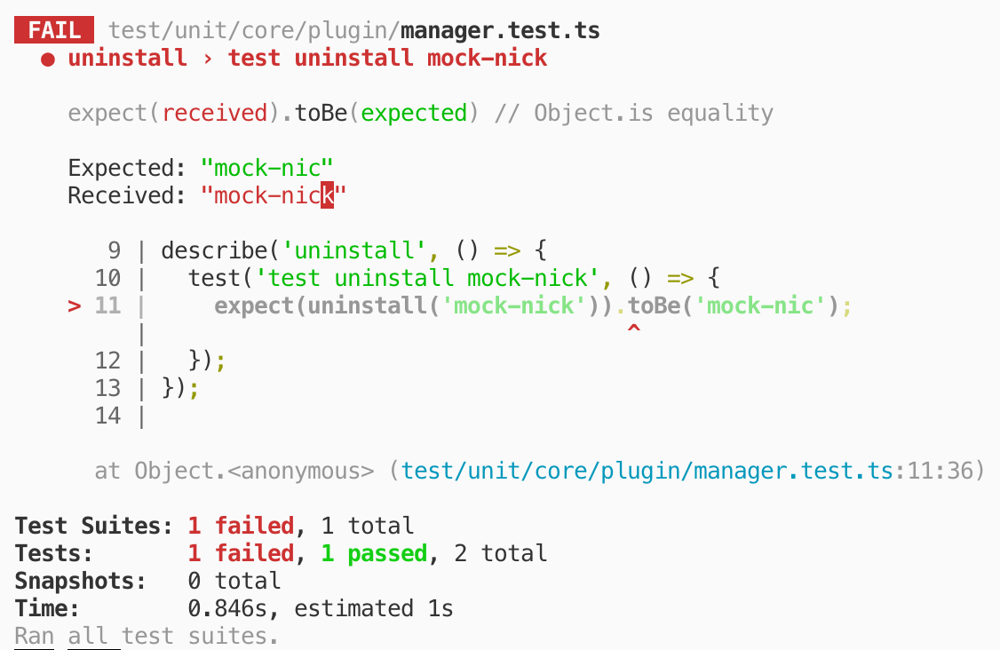
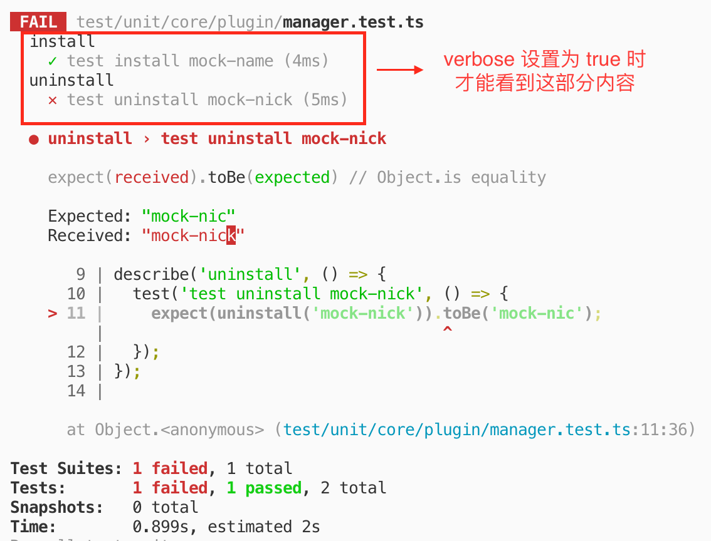

# 探索开源项目的自动化测试 —— Vuetify（一）

## 本章知识点

* [Yarn](https://yarnpkg.com)
* [Lerna](https://lerna.js.org/)
* [Husky](https://github.com/typicode/husky)
* [Jest](https://jestjs.io)

## 测试入口

首先需要找到自动化测试是从哪里开始的，这里的技巧一般是看项目根目录下的 `package.json` 中有没有相关的脚本。很幸运，在 `vuetify` 项目根目录下的 `package.json` 中，我发现了这段代码：

```json
{
    // ...
    "husky": {
        "hooks": {
            "pre-commit": "node scripts/warn-npm-install.js && yarn run lint && yarn lerna run test -- -- -o"
        }
    }
    // ...
}
```

注意 `yarn lerna run test -- -- -o` 这段命令，很显然这就是我要找的测试入口的线索。**这段命令的作用是运行项目的 `packages` 目录下所有包的 `test` 脚本，并带上 `-o` 参数。**

> 如果你不了解 `Yarn` 和 `Lerna` 这两个工具，你也许会看不懂上述的命令，这里做个简单的解释。
>
> 如果你仔细地看过 `Yarn` 的[文档](https://yarnpkg.com/en/docs/cli#locally-installed-clis)，你会发现 `Yarn` 是支持 `yarn <command> [--args]` 的写法的，这个写法就是调用项目本地的命令行工具（即 node_modules/.bin/ 下的脚本）执行一段命令（`command`）。上述命令 `lerna run test` 就是 `command`，所以上述命令实际上就是调用项目本地的 `Lerna` 工具来执行一行命令。
>
> 细心的你也许会注意到上述命令行中存在两个 `--`，这又是什么意思呢？我运行了上述命令后，会发现一个这样的提示：
>
> ```
> warning From Yarn 1.0 onwards, scripts don't require "--" for options to be forwarded. In a future version, any explicit "--" will be forwarded as-is to the scripts.
> ```
>
> 这行提示是说命令行中存在一个过时的 `--` 参数语法，说明有一个 `--` 是 `Yarn` 的老语法，新版本不用传了，但后面我们会讲到在这种场景下不得不传。
>
> 如此一来，剩下的 `--` 和 `-o` 便是 `Lerna` 命令的参数了，所以上述命令实际上是调用项目本地的 `Lerna` 执行 `lerna run test -- -o`。
>
> 从 `Learn` 的文档可知，`lerna run test -- -o` 的作用是执行项目的 `packages` 目录下所有包中含有 `test` 脚本的命令（不含有的包会自动跳过），而 `--` 符号可以将后面的参数传递给 `test` 脚本，和 `Yarn` 的 `--` 语法一致。
>
> 这里可以回答之前的一个问题了，即为什么必须写 `Yarn` 的 `--` 参数？我们可以想一想，如果只留一个 `--`，那么这个 `--` 还是会被 `Yarn` 识别，最终导致实际运行的命令行是 `lerna run test -o`，这将会报错，所以两个 `--` 都得保留。
>
> 还有一个思考题，就是不知道大家有没有想过这里为什么不直接写 `lerna run test -- -o` 而要写成 `yarn lerna run test -- -- -o`。我一开始也进入了这个直觉陷阱，认为一般这样写不也是调用本地的 `Lerna` 工具吗？后来才反应过来，那只是 `npm scripts` 的特性，只在 `scripts` 里面那么写，而这里是 `husky` 的配置，不能直接支持调用本地的命令行工具，需要借助 `Yarn` 的这个特性。于是我又去翻了翻 `husky` 的文档，发现里面提到如果命令要支持调用本地命令行工具执行，还需要配置 `~/.huskyrc` 文件，这还不如使用 `Yarn` 的特性来得方便。

接下来便是寻找哪些包里面有 `test` 脚本，幸运地是，只有 `packages/vuetify` 这个包包含 `test` 脚本，脚本对应的命令如下：

```json
"test": "node build/run-tests.js"
```

`test` 脚本实际执行了 `build/run-tests.js` 文件，于是我看了下 `build` 目录下的 `run-tests.js`，发现它针对不同系统运行了不同的测试脚本，`Windows` 下运行 `yarn test:win32 -o`，其他系统运行 `yarn test:unix -o`。（*提示：这里的 `-o` 就是之前入口处带的 `-o` 参数*）

通过 `package.json` 文件可以知道 `yarn test:win32 -o` 实际上运行的是 `jest -i -o`，`yarn test:unix -o` 实际上运行的是 `jest -o`（*提示：当运行 `yarn <script> [...args]` 的时候，运行脚本对应的命令时也会加上 `args` 里的那些参数*）。

那么，带有 `-i` 和 没带有 `-i` 参数有什么区别呢？通过 `Jest` 文档可知，`-i` 是 `--runInBand` 的短命名方式，`-i` 代表所有测试会串行地在当前进程中执行，这就能够逐步调试了，而 `Jest` 默认是将测试通过创建子进程地方式运行，无法调试。想必 `Windows` 不通过串行方式在当前进程中执行，会遇到一些问题吧，具体是什么问题还需要大家亲身测试下告诉我哈。

而 `-o` 参数则代表仅对更改的文件进行测试，配合 `Git` 使用就很节约时间了。

**至此，忽略无关紧要的 `-i` 参数，我们知道了 `Vuetify` 项目的测试入口实际就是在 `packages/vuetify` 下运行 `jest -o`。**

## 测试配置

`Jest` 的运行离不开它的配置，这从 `Jest` 文档中简单看两眼也能知道，以下是 `Vuetify` 项目中 `packages/vuetify` 的配置（*提示：已经将配置中依赖的其他配置展开*）：

```js
{
    // 多于一个测试文件运行时不展示每个测试用例测试通过情况
    verbose: false,
    // 测试用例运行在一个类似于浏览器的环境里，可以调用浏览器的 API
    testEnvironment: 'jest-environment-jsdom-fourteen',
    // 以 <rootDir>/src 这个目录做为根目录来搜索测试文件（模块）
    roots: [
        '<rootDir>/src',
    ],
    // 在测试环境准备好之后且每个测试文件执行之前运行下述文件
    setupFilesAfterEnv: [
        '<rootDir>/test/index.ts',
    ],

    // 测试文件模块之间的引用应该是自己实现了一套类似于 Node 的引用机制
    // 不过自己可以配置，下面 module 开头的都是配置这个的，都用例子来说明

    // 例如，require('./a') 语句会先找 `a.ts`，找不到找 `a.js`
    moduleFileExtensions: [
        'ts',
        'js',
    ],
    // 例如，require('a') 语句会递归往上层的 node_modules 中寻找 a 模块
    moduleDirectories: [
        'node_modules',
    ],
    // 例如，require('@/a.js') 会解析成 require('<rootDir>/src/a.js')
    moduleNameMapper: {
        '^@/test$': '<rootDir>/test/index.js',
        '^@/test/(.*)$': '<rootDir>/test/$1',
        '^@/(.*)$': '<rootDir>/src/$1',
        '\\.(css|sass|scss)$': 'identity-obj-proxy',
    },
    // 转译下列模块为 Jest 能识别的代码
    transform: {
        '\\.(styl)$': 'jest-css-modules',
        '\\.(sass|scss)$': 'jest-css-modules',
        '.*\\.(j|t)s$': 'ts-jest',
    },
    // 收集这些文件的测试覆盖率
    collectCoverageFrom: [
        'src/**/*.{js,ts,tsx}',
        '!**/*.d.ts',
    ],
    // 排除 node_modules/vue-router 包以外的都被忽略
    // 说明 vue-router 这个还是要被 `ts-jest` 转译
    transformIgnorePatterns: [
        'node_modules/(?!vue-router)',
    ],
    snapshotSerializers: [
        'jest-serializer-html',
    ],
    // 从下列文件中寻找测试文件
    testMatch: [
        // Default
        '**/test/**/*.js',
        '**/__tests__/**/*.spec.js',
        '**/__tests__/**/*.spec.ts',
    ],
    // 将 `ts-jest` 的配置注入到运行时的全局变量中
    globals: {
        'ts-jest': {
            // 是否使用 babel 配置来转译
            babelConfig: true,
            // 编译 Typescript 所依赖的配置
            tsConfig: '<rootDir>/tsconfig.test.json',
            // 是否启用报告诊断，这里是不启用
            diagnostics: false,
        },
    },
    // Jest 文档中无此配置，应该已经过时了
    name: 'Vuetify',
    // 测试文件名旁边显示的标识
    displayName: 'Vuetify',
    // 在测试环境准备好之前且每个测试文件执行之前运行下述模块
    setupFiles: [
        'jest-canvas-mock'
    ]
}
```

在进入每一项配置的解读之前，我们对项目中的文件分成两类，一类是测试文件，一类是非测试文件。所谓测试文件就是指该文件内写的是测试代码，非测试文件与之相反，他们之间的关系是非测试文件中的功能可能会被测试文件引用并测试。

下面进入每一项配置属性的详细解读，让大家对 `Jest` 运行时遵循的一些规则有所了解，顺序按笔者认为的重要程度排列：

### rootDir

字符串类型，这个就是设置 `Jest` 配置中 `<rootDir>` 模版字符串的值。默认就是 `Jest` 配置所在的目录，如果你的配置写在 `package.json` 文件中，那就是 `package.json` 文件所在的目录，简而言之，基本上都是你运行 `jest` 命令所在的目录。**由于配置中经常用到，所以明白其含义是非常重要的。**

### roots

这个配置就是定义 `Jest` 从哪些目录里面去搜索测试文件。默认值就是 `<rootDir>`。

### testMatch

很重要的属性，不知道为什么官网不最先说，我连 `Jest` 怎么搜索到测试文件来跑的都不知道，那我怎么知道该在哪写测试文件呢？

如果说 `roots` 属性规定了 `Jest` 搜索测试文件的范围，那么 `testMatch` 属性就能让 `Jest` 在这个范围内精准地规定哪些文件是测试文件。如果 `testMatch` 定义的搜索范围超出了 `roots` 定义的范围，这些超出范围之外的测试文件是不会执行的。

**默认情况下，Jest 搜索测试文件的原则如下：**

* 以 `jest.config.js` 配置文件或 `package.json` 所在位置（一般也是 `Jest` 命令运行的目录）为根目录；
* 搜索根目录下所有 `__test__` 文件夹下的 `js`、`.jsx`、`ts`、`.tsx` 的文件，作为测试文件放到测试环境中运行；
* 搜索根目录下所有后缀为 `.test.[js|ts|jsx|tsx]` 或 `.spec.[js|ts|jsx|tsx]` 的文件；
* 搜索根目录下所有名为 `test.[js|ts|jsx|tsx]` 或 `spec.[js|ts|jsx|tsx]` 的文件。

**自定义后，搜索的文件就从根目录按自定义的路径和文件类型来搜寻测试文件。**

了解这个属性后，就知道测试文件写在哪里了，比如有些开源项目不配置这个属性，直接在需要测试的源代码文件所在的目录中建立 `__test__` 文件夹，在其中写 `js` 或 `ts` 文件，后面的系列中我们会看到。

同时，与此类似的属性是 `testRegex`，可以自行前往[中文文档](https://jestjs.io/docs/zh-Hans/configuration#testregex-string-array-string)研究。

### testEnvironment

字符串类型，表示测试用例运行的环境，内置环境可以有两个选择：

* jsdom。默认值，一个类似于浏览器的环境。
* node。一个类似于 Node 的环境。

另外，还可以通过自己安装环境包来设置环境：

* `<package-name>`。使用 NPM 包中的某个环境。例如，第一个 `jsdom` 选项其实是 `Jest` 默认带的 `jsdom@11`，如果想用更高版本的 `jsdom`，就得自己安装了。`Vuetify` 使用的就是自己安装的高版本 `jsdom` 环境，即 `jest-environment-jsdom-fourteen`。

文档上还提到，如果要让某个文件下的测试用例走单独的环境，可以在文件顶部加 `@jest-environment <env>` 注释来实现。

另外，`Jest` 还支持自定义测试环境，这部分可以自行查看官方文档进行了解，后续有机会我也会新开一篇文章进行讲解。

至于 `Vuetify` 为什么要用高版本 `jsdom`，我的想法是越高的版本实现的浏览器的 API 越多，正好 `Vuetify` 要用到或者将来要用到更高级的 `API`，所以就用了高版本的 `jsdom` 了。

### transform

这个属性是设置哪些文件中的代码是需要被相应的转译器转换成 `Jest` 能识别的代码，`Jest` 默认是能识别 `JS` 代码的，其他语言，例如 `Typescript`、`CSS` 等都需要被转译。例如 `Vuetify` 中就用到了 `ts-jest` 来转译 `Typescript`，用到了 `jest-css-modules` 来转译样式模块。这有点像 `Webpack` 的 `loader`。

### transformIgnorePatterns

这个属性是设置哪些文件不需要转译的。默认是 `node_modules` 中的模块不需要转译，当然如果 `node_modules` 中有些模块仍需要被转译，你可以像 `Vuetify` 一样设置该属性。

### moduleFileExtensions

接下来的三个属性 `moduleFileExtensions`、`moduleDirectories`、`moduleNameMapper` 这些以 `module` 开头的属性都是设置模块引用代码的解析规则。这些规则既作用于测试文件也作用于非测试文件，**默认情况下这些规则和 Node 的模块解析规则有点像，但是请记住测试时代码并不是运行在 Node 中，而是 `testEnvironment` 属性定义的测试环境中，因此你可以更灵活的定义模块解析的规则。**

`moduleFileExtensions` 属性就规定了模块检索的文件类型，例如你写了 `require('./a)`，然后 moduleFileExtensions 配的是 ['ts', 'js']，那就先找 `./a.ts`，找不到就找 `./a.js`。所以你的项目用什么语言写的，就应该把该语言的后缀名放在最前面，这样检索效率也会更高。**值得注意的是，这个属性配置中必须包含 `js` 配置**。

## moduleDirectories

这个属性对直接引用模块名而不是路径的方式定义了模块搜索路径，例如你在代码里面写了 `require(<module-name>)` 这样一句代码，默认情况下就会和 `Node` 一样递归搜索 `node_modules` 目录中是否含有这个名字的模块。如果你配置了其他目录名，就会递归搜索那个文件夹下面的模块了。

## moduleNameMapper

这个属性是对模块路径映射，键是正则表达式，值是模块地址，可以用 `$1` 之类的符号来表示路径中匹配的字符串。值得注意的是，值必须是完整的模块路径，和 `Webpack` 中的 `alias` 有所不同，比如以 `Webpack` 的思维，我想用 `@` 代替项目根目录的 `src`，那么直接写 `'@': 'src'` 就行了，而这里就不能写成类似的 `@: '<rootDir>/src'` 了，得写成 `'^@/(.*)$': '<rootDir>/src/$1'`，`$1` 解析出来后就是个完整的模块路径。**总的来说，`Webpack` 做的更像是对路径上的部分字符串做个替换，而 `Jest` 则是匹配路径后，将整个路径用对应的值给完全替换掉，这个思维的转变很重要**。

但是，对于 `Typescript` 项目来说，可能光配置 `moduleNameMapper` 属性还是无法解析别名路径的，如果项目和 `Vuetify` 一样，用了 `ts-jest` 来解析 `Typescript`，那么还得配置以下内容才能生效：

```js
globals: {
    'ts-jest': {
        diagnostics: false
    }
}
```

这里的原因是，如果开启了 `diagnostics`，就会在编译前执行诊断，诊断时会报模块无法找到的错误，从而终止编译。

### globals

这个属性是设置测试环境中的全局变量的，如果你在 `globals` 中新增了一个 `name: 'vabaly'` 的配置，那么你将在代码（包含测试文件和非测试文件）中无需声明而直接使用 `name` 或者 `global.name` 来获得 `vabaly` 这个值。

### setupFiles

这个属性是定义在每个测试文件运行之前，且在测试环境准备好前就会立即执行的文件或模块。

### setupFilesAfterEnv

这个属性是定义在每个测试文件运行之前，且在测试环境准备好后就会立即执行的文件或模块。

无论是 `setupFiles` 还是 `setupFilesAfterEnv`，都会在测试文件运行第一行代码前执行。

### collectCoverageFrom

这个属性是收集符合 Glob 模式匹配的文件的测试覆盖率，这个和 `collectCoverage` 属性是相关联的，只有 `collectCoverage` 设为 `true`，或者命令行中带有 `--coverage` 参数，这个配置才会生效。

值得注意的是，当只设置 `collectCoverage` 为 `true` 时，那么就只会收集测试过程中用到的非测试文件的测试覆盖率。如果又设置了 `collectCoverageFrom`，则只会收集 `collectCoverageFrom` 指定的非测试文件的测试覆盖率，而且不管该文件有没有在测试中被用到，都会收集，只不过该文件的测试覆盖率是零罢了。如果你想知道你的代码有哪些还没被覆盖到，设置这个属性是十分有必要的。

### verbose

布尔值，默认值是 `false`。设置是否在运行期间展示每个单独测试用例的测试情况（PASS or Fail）。不过无论设置什么，都会在尾部显示测试错误信息以及总体通过情况，可看下面两张图体会：

1. verbose 设为 false 的时候：
    
2. verbose 设为 true 的时候：
    

值得注意的是，当 `verbose` 设为 `false`，且只有一个测试文件运行时，还是会显示出每个单独测试用例的测试情况，多个测试文件运行时，就不会显示出来了。只有 `verbose` 为 `true` 时才会显示出来。

### displayName

字符串类型，定义在每个测试文件名旁边高亮显示的名字，方便区分不同包的测试，比如设置 `displayName: 'TEST'` 之后，终端运行测试时就会显示成下图这样：


## 总结

明白了上述的配置含义，基本上就能看懂大多数场景下的测试代码的组织形式了。

在弄清楚 `Vuetify` 的测试命令和测试配置之后，接下来就到了激动人心的测试代码欣赏时间，不过由于本章篇幅过长以及作者精力问题，我们下回再讲！
